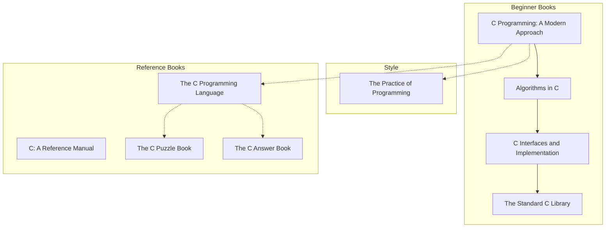

https://cse.unl.edu/~cbourke/ComputerScienceOne.pdf

Dive into Systems course: https://www.cs.swarthmore.edu/~sukrit/cs31/s24/

Mike Shah C Course: https://www.youtube.com/playlist?list=PLvv0ScY6vfd8M-Mi_Vyrg7KgISTW3Sklt
Write Your Own OS: https://www.youtube.com/@writeyourownoperatingsystem
https://www.youtube.com/@OpenSecurityTraining/playlists
https://www.youtube.com/playlist?list=PLvaIU2QC2uvFnVxXe-XzXJfd4dXGz5qBB

https://github.com/gurugio/lowlevelprogramming-university

| Name                             | Author    | C Standard | Description                                  |
| -------------------------------- | --------- | ---------- | -------------------------------------------- |
| C Programming: A Modern Approach | K.N. King | C89 / C99  | A solid beginner book with lots of examples. |

[Stanford CS107](https://see.stanford.edu/course/cs107)

http://cs.yale.edu/home/aspnes/classes/223/notes.html

https://www.coursera.org/specializations/c-programming

https://open.umn.edu/opentextbooks/subjects/computer-science-information-systems

## Free Resources

### Books

Course and has K&R C Book freely available - https://www.cc4e.com/

https://github.com/EbookFoundation/free-programming-books/blob/main/books/free-programming-books-langs.md#c
https://www.reddit.com/r/C_Programming/comments/872rlt/c_project_based_tutorials/

A Commentary on the Unix Operating System: https://bitsavers.org/pdf/att/unix/6th_Edition/Lions_-_A_Commentary_on_the_Unix_Operating_System_197705.pdf

Source Code for A Commentary on the Unix Operating System: http://v6.cuzuco.com/

xv6, A Modern Reimplementation of Unix V6: http://pdos.csail.mit.edu/6.828/xv6

Note that OSTEP has xv6 labs

HTML Version of Lions: https://warsus.github.io/lions-/

Modern PDF (not scan) of Lions: http://www.lemis.com/grog/Documentation/Lions/

https://www.distributed-systems.net/index.php/books/ds4/

| Name                                                                                                                                                    | Author                                    | C Standard | Description                                  |
| ------------------------------------------------------------------------------------------------------------------------------------------------------- | ----------------------------------------- | ---------- | -------------------------------------------- |
| [The C Book](https://publications.gbdirect.co.uk/c_book/)                                                                                               | Mike Banahan, Declan Brady and Mark Doran | C89        | A solid beginner book with lots of examples. |
| [C Elements of Style](http://www.oualline.com/books.free/style/index.html)                                                                              | Steve Oualline                            |            |                                              |
| [Modern C](https://gustedt.gitlabpages.inria.fr/modern-c/)                                                                                              | Jens Gusted                               | C23        |                                              |
| [Algorithm Design (in C)](https://www.ime.usp.br/~pf/algorithms/)                                                                                       | Paulo Feofiloff                           |            |                                              |
| [Beej's Guide to C Programming](http://beej.us/guide/bgc/)                                                                                              | Brian Jorgansen                           |            |                                              |
| [Beej's Guide to Network Programming](http://beej.us/guide/bgnet/html/multi/index.html)                                                                 |                                           |            |                                              |
| [Dive into Systems](https://diveintosystems.org/book/)                                                                                                  |                                           |            |                                              |
| [Build Your Own Lisp](http://buildyourownlisp.com/)                                                                                                     |                                           |            |                                              |
| [C Programming Notes](https://www.eskimo.com/~scs/cclass/notes/top.html)                                                                                | Steve Summit                              |            |                                              |
| [The GNU C Programming Tutorial](https://www.it.uc3m.es/pbasanta/asng/course_notes/ctut.pdf)                                                            | Mark Burgess                              |            |                                              |
| [Learning GNU C](https://www.nongnu.org/c-prog-book/online/index.html)                                                                                  |                                           |            |                                              |
| [Programming in C UNIX System Calls and Subroutines using C](https://users.cs.cf.ac.uk/Dave.Marshall/C/CE.html)                                         | A.D. Marshall                             |            |                                              |
| [Essential C](http://cslibrary.stanford.edu/101/)                                                                                                       | Nick Parlante                             |            |                                              |
| [Little OS Book](https://littleosbook.github.io/)                                                                                                       |                                           |            |                                              |
| [Foundations of Computer Science](http://infolab.stanford.edu/~ullman/focs.html)                                                                        |                                           |            |                                              |
| [Operating Systems: Three Easy Steps](https://pages.cs.wisc.edu/~remzi/OSTEP/)                                                                          |                                           |            |                                              |
| [Compiler Design in C](https://holub.com/compiler/)                                                                                                     |                                           |            |                                              |
| [How to Think Like a Computer Scientist: C Version](https://open.umn.edu/opentextbooks/textbooks/how-to-think-like-a-computer-scientist-c-version-1999) |                                           |            |                                              |
| [Computer Science I](https://open.umn.edu/opentextbooks/textbooks/computer-science-i)                                                                   |                                           |            |                                              |

### Programming Tutorials

| Name                                                                                                            | Author | C Standard | Description |
| --------------------------------------------------------------------------------------------------------------- | ------ | ---------- | ----------- |
| [Jacob Sorber](https://www.youtube.com/c/JacobSorber)                                                           |        |            |             |
| [Introduction to Programming using C](https://www.youtube.com/playlist?list=PLcb47MKbeHkcBhhAdLDJObMibJsfb8cz4) |        |            |
| [Bro Code C Tutorial](https://www.youtube.com/playlist?list=PLZPZq0r_RZOOzY_vR4zJM32SqsSInGMwe)                 |        |            |             |

https://ocw.mit.edu/courses/6-087-practical-programming-in-c-january-iap-2010/resources/mit6_087iap10_lec01/

http://doctord.dyndns.org/Courses/UNH/CS610/Phil's_C_Course.htm

https://c-faq.com/

https://github.com/tuhdo/os01/tree/master

https://blog.llvm.org/2011/05/what-every-c-programmer-should-know_14

https://www.intel.com/content/www/us/en/developer/tools/documentation.html

