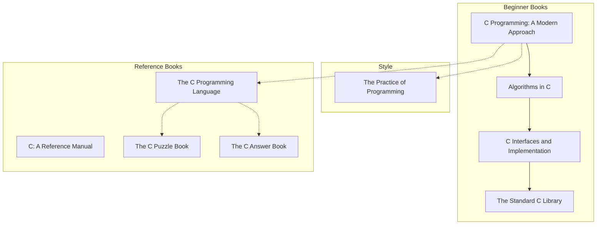

| Name                             | Author    | C Standard | Description                                  |
| -------------------------------- | --------- | ---------- | -------------------------------------------- |
| C Programming: A Modern Approach | K.N. King | C89 / C99  | A solid beginner book with lots of examples. |

[Stanford CS107](https://see.stanford.edu/course/cs107)

http://cs.yale.edu/home/aspnes/classes/223/notes.html

https://www.coursera.org/specializations/c-programming